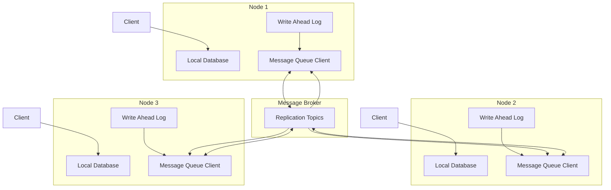
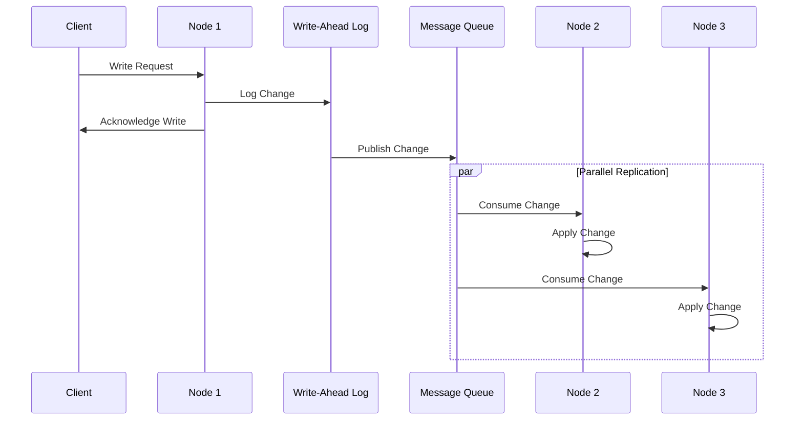
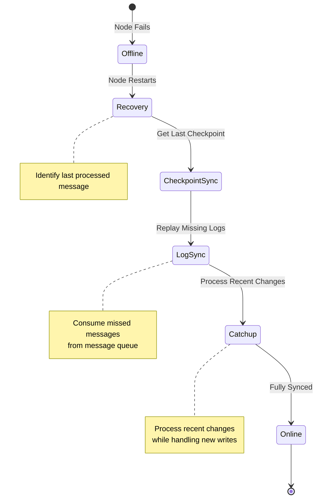

# latticelq

## Project Overview

A distributed database system using supposed peer-to-peer architecture where nodes communicate through message brokers for data replication. Unlike traditional consensus-based systems, this approach prioritizes availability and partition tolerance through message-based eventual consistency.

> Debating whether to have a central node monitoring all nodes or have the nodes take care of themselves with a consensus algo.

## Core Features

- Message-based replication using write-ahead logs
- Peer discovery and health monitoring
- Version tracking for conflict detection
- Local-first reads with peer fallback
- Automatic recovery and resynchronization

## Write Operation Flow

## System Components

### 1. Storage Layer
#### Local Database Engine
- Uses embedded databases (SQLite/RocksDB) for durability and performance
- Each node maintains complete ownership of its local data
- Supports fast local reads without network overhead

#### Write-Ahead Logging (WAL)
- Records all modifications before applying them
- Enables crash recovery and replication
- Serves as source of truth for data changes
- Critical for ensuring no data loss during node failures

#### Version Management
- Uses vector clocks or timestamps for change tracking
- Enables conflict detection across nodes
- Supports eventual consistency model
- Essential for handling concurrent updates in distributed setting

### 2. Message Layer
#### Message Broker Integration
- Uses Apache Kafka/RabbitMQ for reliable message delivery
- Handles back-pressure and message persistence
- Enables loosely coupled node communication

#### Log Streaming
- Publishes database changes as ordered log streams
- Enables efficient batch processing of updates
- Supports catch-up replication for lagging nodes
- Reduces network overhead through batching

#### Flow Control
- Manages replication rate between nodes
- Prevents overwhelming slow consumers
- Handles back-pressure from message broker
- Essential for system stability under load

## Node Recovery Process

### 3. Node Management
#### Peer Discovery
- Maintains registry of active nodes
- Handles node join/leave events
- Updates replication topology
- Critical for system scalability

#### Health Monitoring
- Tracks node status and replication lag
- Identifies failed or slow nodes
- Triggers recovery procedures
- Essential for maintaining system reliability

#### Recovery Procedures
- Handles node failure scenarios
- Manages catch-up replication
- Resolves data inconsistencies
- Important for system resilience

### 4. Client Interface
#### Query API
- Provides CRUD operations
- Supports consistency level selection
- Handles read/write routing
- Essential for application integration

#### Monitoring
- Exposes system metrics
- Tracks replication status
- Monitors resource usage
- Critical for operations and troubleshooting

## Technical Considerations
- Network partition handling
- Message ordering guarantees
- Data consistency models
- Failure recovery strategies
- Performance optimization
- Resource utilization
- Security implications
